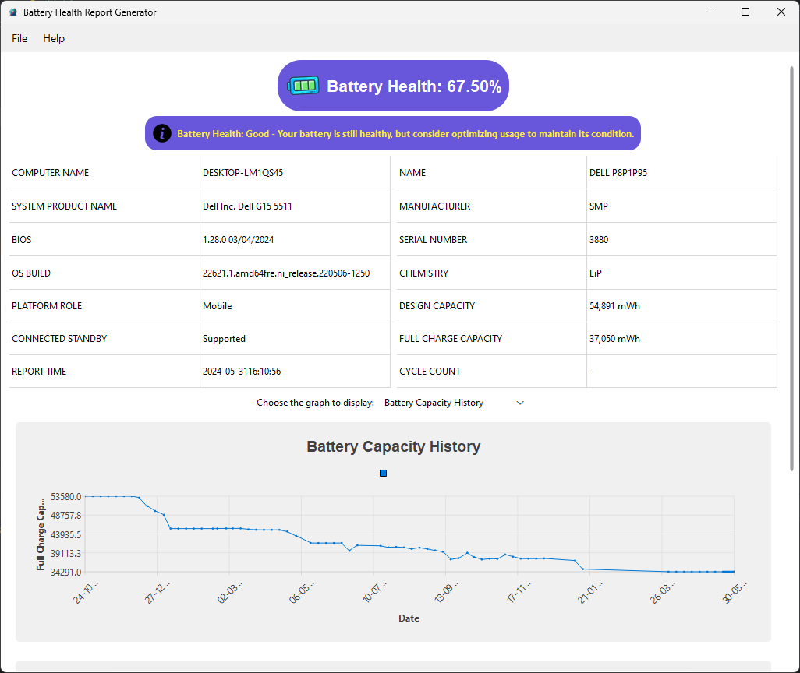
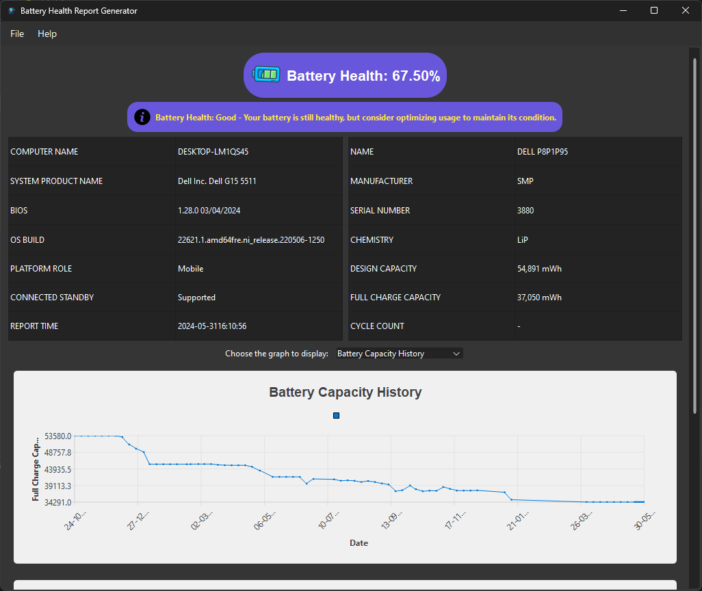
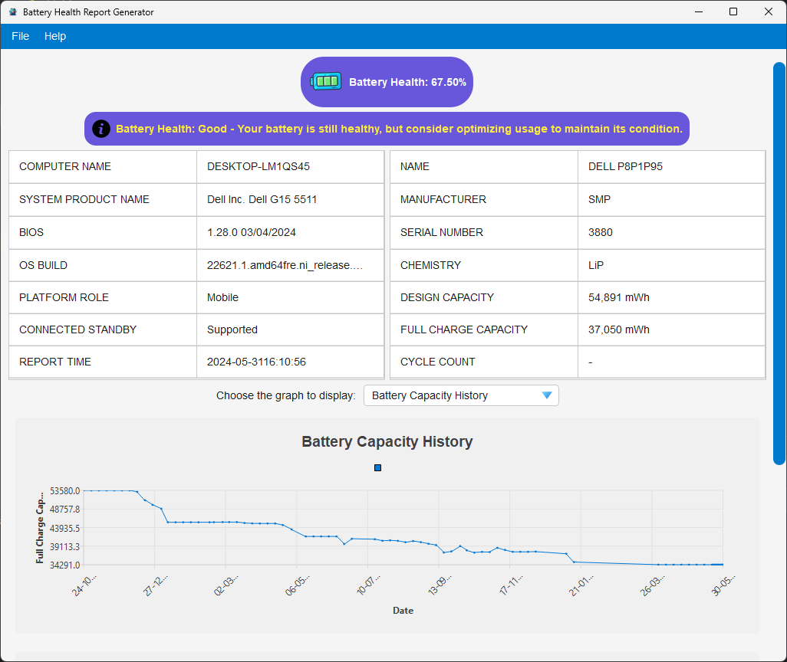

<h1>Battery Health Report Generator</h1>

<h2>To Create Dist Folder</h2>
<pre><code>pyinstaller --name="Battery Health Report Generator" --icon="icons/app_icon.ico" --add-data="icons;icons" --add-data="stylesheets;stylesheets" --windowed --onedir --contents-directory "." app.py clean.py extract.py generate.py load_json.py</code></pre>

    <h3>Note:</h3>
    
<strong>1.</strong> To make it window-based, add the <code>-w</code> (a.k.a. <code>--windowed</code>) option. Then your executable will start without the console attached.

    
<strong>2.</strong> To get the <code>.exe</code> file and data in one folder, use <code>--contents-directory</code>. (It's necessary to pass <code>--onedir</code> too)

<h2>Design</h2>

<h3>Light Theme</h3>
    
    
<h3>Dark Theme</h3>
    

<h3>Accent Theme</h3>
    

