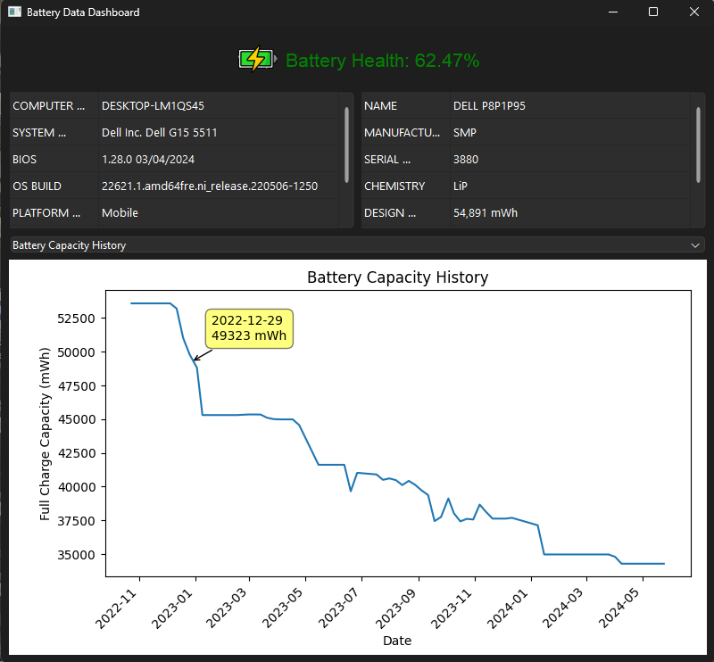

# Battery-Health-Report-Generator
 
### To create .exe file
`pyinstaller --name="Battery Health Report Generator" --icon="D:\Projects\Battery Health Report Generator\app_icon.ico" --add-data="D:\Projects\Battery Health Report Generator\battery_icon.png;." --windowed app.py clean.py extract.py generate.py load_json.py`

Note: *To make it window-based. Add the -w (a.k.a. --windowed) option. Then your executable will start without the console attached.*

### Current design
